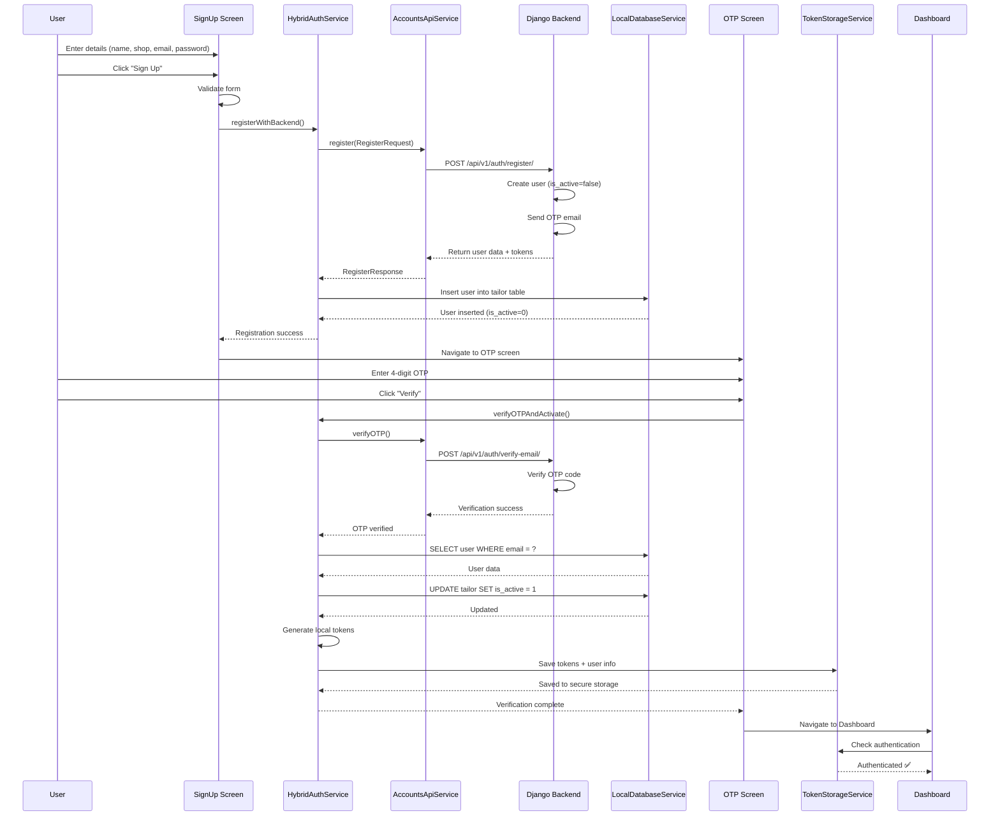
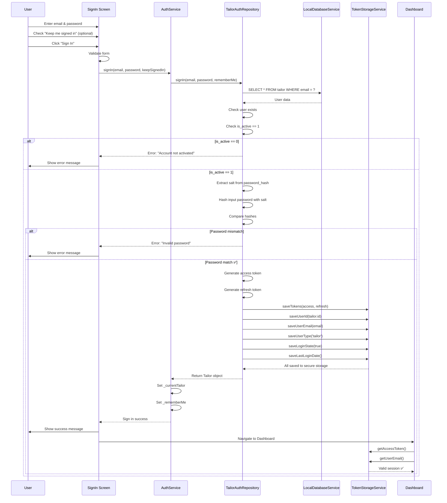

# 📚 Complete Authentication Flow Documentation

## Table of Contents
1. [Overview](#overview)
2. [Sign Up Flow](#sign-up-flow)
3. [Sign In Flow](#sign-in-flow)
4. [Architecture](#architecture)
5. [Screens & Components](#screens--components)
6. [Services & Repositories](#services--repositories)
7. [Database Schema](#database-schema)
8. [Flow Diagrams](#flow-diagrams)
9. [Error Handling](#error-handling)
10. [Testing Guide](#testing-guide)

---

## Overview

Your Tailor App uses a **Hybrid Authentication System**:
- **Backend (Django)**: Handles registration, OTP generation/verification
- **Local (SQLite)**: Handles authentication, token storage, session management

### Key Features
✅ Email/Password registration with OTP verification  
✅ Social authentication (Google, Facebook)  
✅ Local-first authentication after verification  
✅ Secure token storage (flutter_secure_storage)  
✅ Session persistence  
✅ Multi-language support  

---

## Sign Up Flow

### 🎯 Complete Sign Up Journey

```
User Action                    → Screen               → Service                 → Database
────────────────────────────────────────────────────────────────────────────────────────────
1. Open App                   → SignUp Screen         → -                       → -
2. Enter Details              → SignUp Screen         → -                       → -
   - Name
   - Shop Name
   - Email
   - Password
3. Click "Sign Up"            → SignUp Screen         → HybridAuthService       → -
                                                        → AccountsApiService      → Django Backend
                                                                                  (Creates user)
                                                                                  (Sends OTP email)
4. Backend Response           → SignUp Screen         → HybridAuthService       → Local SQLite
                                                        (Inserts user)             (tailor table)
                                                                                  (is_active = 0)
5. Navigate to OTP            → OTP Screen            → -                       → -
6. Enter OTP (4 digits)       → OTP Screen            → -                       → -
7. Click "Verify"             → OTP Screen            → HybridAuthService       → -
                                                        → AccountsApiService      → Django Backend
                                                                                  (Verifies OTP)
8. OTP Verified               → OTP Screen            → HybridAuthService       → Local SQLite
                                                        (Updates is_active = 1)    (Updates user)
                                                        (Generates local tokens)
                                                        (Saves to secure storage)
9. Navigate to Dashboard      → Dashboard Screen      → AuthService             → Reads from
                                                        (Checks authentication)    TokenStorage
```

### 📋 Sign Up Screen Details

**File:** `lib/features/auth/screens/signup_screen.dart`

#### UI Components
- **Logo & Title**: App branding
- **Name Field**: User's full name (required)
- **Shop Name Field**: Business name (required)
- **Email Field**: Email with validation & existence check
- **Password Field**: Min 8 chars, uppercase, lowercase, number
- **Sign Up Button**: Primary action button
- **Google Sign Up Button**: Social authentication
- **Facebook Sign Up Button**: Social authentication
- **Language Selector**: Floating action button (top-right)
- **Footer**: "Already have an account? Sign In"

#### Validation Rules
```dart
Name:
- Required
- Cannot be empty

Shop Name:
- Required
- Cannot be empty

Email:
- Required
- Must match email pattern: ^[\w-\.]+@([\w-]+\.)+[\w-]{2,4}
- Async check: Email must not exist in database
- Real-time validation on blur

Password:
- Required
- Minimum 8 characters
- Must contain: uppercase, lowercase, number
- Pattern: ^(?=.*[a-z])(?=.*[A-Z])(?=.*\d).{8,}$
```

#### Key Methods

**1. `_validateAndSubmit()`**
```dart
- Validates form
- Calls HybridAuthService.registerWithBackend()
- Shows loading indicator
- On success: Navigates to OTP screen
- On error: Shows error message
```

**2. `_checkEmailExists(String email)`**
```dart
- Real-time email validation
- Debounced API call
- Updates error state if email exists
- Called on email field blur
```

**3. `_handleSignUpSuccess()`**
```dart
- Called after successful backend registration
- Navigates to OTP screen with:
  - firstTitle: "Verification Code"
  - secondTitle: "We sent OTP to your email"
  - emailText: user's email
  - email: user's email (for API call)
  - onVerified: callback function
```

---

## OTP Verification Flow

### 📋 OTP Screen Details

**File:** `lib/features/auth/screens/otp_screen.dart`

#### UI Components
- **Logo & Title**: Verification branding
- **Email Display**: Shows email where OTP was sent
- **4 OTP Input Fields**: Single digit each
- **Error Message**: Displays validation/verification errors
- **Verify Button**: Primary action
- **Resend OTP Link**: Available after 180 seconds cooldown
- **Timer Display**: Shows countdown until resend is available

#### Key Features

**1. Auto-Focus Management**
```dart
- Pin 1: No auto-focus (keyboard doesn't open automatically)
- Pin 2-4: Auto-focus when previous pin is entered
- Backspace: Returns to previous pin field
```

**2. Resend OTP Timer**
```dart
- Initial countdown: 180 seconds (3 minutes)
- Updates every second
- Disables resend button during countdown
- Shows formatted time: "2:35"
```

**3. OTP Verification Process**
```dart
async _verifyOTP() {
  1. Concatenate 4 pin digits
  2. Validate OTP length (must be 4)
  3. Call HybridAuthService.verifyOTPAndActivate()
  4. Show loading indicator
  5. On success:
     - Show success message
     - Cancel countdown timer
     - Call onVerified() callback
     - Navigate to dashboard
  6. On error:
     - Display error message
     - Clear OTP fields
     - Allow retry
}
```

**4. Backend OTP Verification**
```dart
HybridAuthService.verifyOTPAndActivate():
  1. Call Django API to verify OTP
  2. Fetch user from local DB
  3. Update is_active = 1
  4. Generate local access & refresh tokens
  5. Save tokens to TokenStorageService
  6. Save user info (userId, email, userType)
  7. Set login state = true
  8. Save last login date
  9. Set currentTailor with active status
  10. Return success
```

---

## Sign In Flow

### 🎯 Complete Sign In Journey

```
User Action                    → Screen               → Service                 → Database
────────────────────────────────────────────────────────────────────────────────────────────
1. Open App                   → SignIn Screen         → -                       → -
2. Enter Credentials          → SignIn Screen         → -                       → -
   - Email
   - Password
3. Check "Keep me signed in"  → SignIn Screen         → -                       → -
   (Optional)
4. Click "Sign In"            → SignIn Screen         → AuthService             → -
                                                        → TailorAuthRepository    → Local SQLite
                                                        (Query user by email)      (tailor table)
5. Password Verification      → SignIn Screen         → TailorAuthRepository    → -
                                                        (Hash & compare)
6. Check is_active            → SignIn Screen         → TailorAuthRepository    → -
                                (Must be 1)
7. Generate Tokens            → SignIn Screen         → TailorAuthRepository    → TokenStorage
                                                        (Access + Refresh tokens)  (Secure storage)
8. Save User Info             → SignIn Screen         → TailorAuthRepository    → TokenStorage
                                                        (userId, email, type)
9. Navigate to Dashboard      → Dashboard Screen      → AuthService             → Reads from
                                                        (User authenticated)       TokenStorage
```

### 📋 Sign In Screen Details

**File:** `lib/features/auth/screens/signin_screen.dart`

#### UI Components
- **Logo & Title**: App branding
- **Email Field**: Email with validation
- **Password Field**: Password with show/hide toggle
- **Keep me signed in**: Checkbox for session persistence
- **Sign In Button**: Primary action button
- **Forgot Password Link**: Navigate to password reset
- **Google Sign In Button**: Social authentication
- **Facebook Sign In Button**: Social authentication
- **Language Selector**: Floating action button (top-right)
- **Footer**: "Don't have an account? Sign Up"

#### Validation Rules
```dart
Email:
- Required
- Must match email pattern
- No async check (just format validation)

Password:
- Required
- Minimum 8 characters
- Must contain: uppercase, lowercase, number
```

#### Key Methods

**1. `_validateAndSubmit()`**
```dart
async _validateAndSubmit() {
  1. Validate form
  2. Show loading indicator
  3. Call AuthService.signIn()
     - email: trimmed email
     - password: password
     - keepSignedIn: checkbox state
  4. On success:
     - Show success feedback
     - Wait 500ms
     - Navigate to dashboard
  5. On error:
     - Handle specific error types:
       * UserNotFoundException → "User not found"
       * InvalidCredentialsException → "Invalid password"
       * AccountLockedException → "Account locked"
       * NetworkException → "Network error"
     - Show error message
}
```

**2. `_navigateToDashboard()`**
```dart
async _navigateToDashboard() {
  1. Use GoRouter to navigate
  2. Navigate to: RouteNames.dashboard
  3. Replace current route (no back button)
  4. Handle navigation errors
}
```

**3. Backend Authentication Process**
```dart
AuthService.signIn():
  1. Validate email & password not empty
  2. Call TailorAuthRepository.signIn()
  
TailorAuthRepository.signIn():
  1. Query local DB: SELECT * FROM tailor WHERE email = ? AND is_deleted = 0
  2. Check if user exists
  3. Check is_active == 1 (must be verified via OTP)
     - If is_active == 0: Throw "Account not activated"
  4. Extract password hash parts (salt:hash)
  5. Hash input password with salt
  6. Compare hashes
     - If mismatch: Throw "Invalid password"
  7. Generate access token (random 64 bytes)
  8. Generate refresh token (random 64 bytes)
  9. Save to TokenStorageService:
     - Access token
     - Refresh token
     - User ID
     - User email
     - User type = 'tailor'
     - Login state = true
     - Last login date
  10. Return Tailor object
  
AuthService:
  11. Set _currentTailor
  12. Set _rememberMe flag
  13. Return true
```

---

## Architecture

### 🏗️ Service Layer Architecture

```
┌─────────────────────────────────────────────────────────────────┐
│                         PRESENTATION LAYER                       │
│  ┌──────────────┐  ┌──────────────┐  ┌──────────────┐          │
│  │ SignUp Screen│  │ SignIn Screen│  │  OTP Screen  │          │
│  └──────────────┘  └──────────────┘  └──────────────┘          │
└─────────────────────────────────────────────────────────────────┘
                              │
                              ▼
┌─────────────────────────────────────────────────────────────────┐
│                          SERVICE LAYER                           │
│  ┌────────────────────┐         ┌────────────────────┐          │
│  │ HybridAuthService  │         │   AuthService      │          │
│  │ (Registration &    │         │   (Local Auth &    │          │
│  │  OTP Verification) │         │    Sign In)        │          │
│  └────────────────────┘         └────────────────────┘          │
│           │                              │                       │
│           ▼                              ▼                       │
│  ┌────────────────────┐         ┌────────────────────┐          │
│  │ AccountsApiService │         │TailorAuthRepository│          │
│  │ (Django Backend)   │         │ (Local DB Auth)    │          │
│  └────────────────────┘         └────────────────────┘          │
└─────────────────────────────────────────────────────────────────┘
                              │
                              ▼
┌─────────────────────────────────────────────────────────────────┐
│                        PERSISTENCE LAYER                         │
│  ┌────────────────────┐         ┌────────────────────┐          │
│  │ TokenStorageService│         │LocalDatabaseService│          │
│  │ (Secure Storage)   │         │   (SQLite)         │          │
│  └────────────────────┘         └────────────────────┘          │
│  flutter_secure_storage          sqflite                        │
└─────────────────────────────────────────────────────────────────┘
```

### 📦 Key Services

#### 1. **HybridAuthService**
**File:** `lib/data/services/hybrid_auth_service.dart`

**Purpose:** Handles registration and OTP verification (backend + local sync)

**Key Methods:**
```dart
class HybridAuthService {
  // Initialization
  Future<void> initialize()
  
  // Registration Flow
  Future<RegisterResponse> registerWithBackend({
    required String name,
    required String shopName,
    required String email,
    required String phone,
    required String password,
    required String passwordConfirm,
    String address = '',
  })
  
  // OTP Verification
  Future<bool> verifyOTPAndActivate({
    required String email,
    required String otpCode,
  })
  
  // Email Check
  Future<bool> checkEmailExists(String email)
  
  // Logout
  Future<void> logout()
  
  // Properties
  Tailor? get currentTailor
  bool get isAuthenticated
  String? get currentUserEmail
}
```

**Registration Process:**
```dart
registerWithBackend():
  1. Validate inputs (name, email, password match)
  2. Create RegisterRequest object
  3. Call AccountsApiService.register()
     - POST /api/v1/auth/register/
     - Django creates user (is_active = false)
     - Django sends OTP email
     - Returns user data + tokens
  4. Insert user into local SQLite database
     - Table: tailor
     - is_active = 0 (not verified yet)
  5. Return RegisterResponse
```

**OTP Verification Process:**
```dart
verifyOTPAndActivate():
  1. Call AccountsApiService.verifyOTP()
     - POST /api/v1/auth/verify-email/
     - Django verifies OTP code
  2. Fetch user from local DB by email
  3. Update local DB: is_active = 1
  4. Generate local tokens:
     - Access token (JWT-like)
     - Refresh token
  5. Save to TokenStorageService:
     - Tokens
     - User ID
     - User email
     - User type = 'tailor'
     - Login state = true
  6. Set currentTailor
  7. Return true
```

#### 2. **AuthService**
**File:** `lib/data/services/auth_service.dart`

**Purpose:** Local authentication and session management

**Key Methods:**
```dart
class AuthService {
  // Initialization
  Future<void> initialize()
  
  // Sign In
  Future<bool> signIn({
    required String email,
    required String password,
    bool keepSignedIn = false,
  })
  
  // Sign Out
  Future<void> signOut({bool clearRememberMe = false})
  
  // Email Check
  Future<bool> checkEmailExists(String email)
  
  // Session
  Future<void> setKeepLoggedIn(bool value)
  
  // Properties
  Tailor? get currentTailor
  Tailor? get currentUser
  bool get isAuthenticated
  bool get isLoggedIn
  String? get currentUserEmail
  bool get keepSignedIn
}
```

**Sign In Process:**
```dart
signIn():
  1. Validate email & password not empty
  2. Call TailorAuthRepository.signIn()
  3. Set _currentTailor
  4. Set _rememberMe flag
  5. Return true on success
  6. Throw AuthException on failure
```

#### 3. **TailorAuthRepository**
**File:** `lib/data/repositories/tailor_auth_repository.dart`

**Purpose:** Database operations for authentication

**Key Methods:**
```dart
class TailorAuthRepository {
  // Registration
  Future<Tailor> signUp({
    required String name,
    required String shopName,
    required String email,
    required String phone,
    required String password,
    String address = '',
    String authProvider = 'email',
  })
  
  // Authentication
  Future<Tailor> signIn({
    required String email,
    required String password,
    bool rememberMe = false,
  })
  
  // Session
  Future<Tailor?> getCurrentTailor()
  Future<bool> isLoggedIn()
  Future<void> signOut()
  
  // Email Check
  Future<bool> checkEmailExists(String email)
}
```

**Sign In Database Flow:**
```dart
signIn():
  1. Query: SELECT * FROM tailor WHERE email = ? AND is_deleted = 0
  2. Check user exists
  3. Check is_active == 1
     - If 0: throw "Account not activated. Please verify your OTP first."
  4. Extract password hash: "salt:hash"
  5. Hash input password with salt
  6. Compare hashes
     - If mismatch: throw "Invalid password"
  7. Generate tokens (random 64 bytes each)
  8. Save to TokenStorageService:
     - saveTokens(accessToken, refreshToken)
     - saveUserId(tailor.id)
     - saveUserEmail(tailor.email)
     - saveUserType('tailor')
     - saveLoginState(true)
     - saveLastLoginDate()
  9. Return Tailor object
```

#### 4. **TokenStorageService**
**File:** `lib/core/services/token_storage_service.dart`

**Purpose:** Secure token and session management

**Storage:** `flutter_secure_storage` (encrypted)

**Key Methods:**
```dart
class TokenStorageService {
  // Token Management
  Future<void> saveAccessToken(String token)
  Future<String?> getAccessToken()
  Future<void> saveRefreshToken(String token)
  Future<String?> getRefreshToken()
  Future<void> saveTokens({
    required String accessToken,
    required String refreshToken,
  })
  Future<void> clearTokens()
  Future<bool> hasAccessToken()
  Future<bool> isAuthenticated()
  
  // User Data
  Future<void> saveUserId(String userId)
  Future<String?> getUserId()
  Future<void> saveUserEmail(String email)
  Future<String?> getUserEmail()
  Future<void> saveUserType(String userType)
  Future<String?> getUserType()
  Future<void> saveLoginState(bool isLoggedIn)
  Future<bool> getLoginState()
  Future<void> saveLastLoginDate()
  Future<DateTime?> getLastLoginDate()
  
  // Clear Data
  Future<void> clearAll()
  Future<void> clearUserData()
}
```

---

## Database Schema

### 📊 Tailor Table (Local SQLite)

**File:** `lib/data/services/local_db_service.dart`

```sql
CREATE TABLE tailor (
  id TEXT PRIMARY KEY,              -- MAT + 7 random chars (e.g., MAT2TZ5PRO)
  unique_id TEXT UNIQUE,            -- Same as id
  name TEXT NOT NULL,               -- User's full name
  shop_name TEXT NOT NULL,          -- Business name
  email TEXT UNIQUE NOT NULL,       -- Email address
  phone TEXT,                       -- Phone number (optional)
  password_hash TEXT NOT NULL,      -- Format: "salt:hash"
  auth_provider TEXT DEFAULT 'email', -- 'email', 'google', 'facebook'
  address TEXT,                     -- Business address
  profile_image_url TEXT,           -- Profile picture URL
  is_active INTEGER DEFAULT 0,      -- ⚠️ CRITICAL: 0 = not verified, 1 = verified
  is_deleted INTEGER DEFAULT 0,     -- Soft delete flag
  created_at TEXT NOT NULL,         -- ISO 8601 timestamp
  updated_at TEXT NOT NULL          -- ISO 8601 timestamp
);
```

### 🔑 Critical Fields

#### **is_active**
- **Type:** INTEGER (0 or 1)
- **Purpose:** OTP verification status
- **Values:**
  - `0` = User registered but NOT verified (cannot login)
  - `1` = User verified via OTP (can login)
- **Set by:**
  - Registration: `0`
  - OTP Verification: `1`
- **Checked by:** `TailorAuthRepository.signIn()`

#### **password_hash**
- **Format:** `"salt:hash"`
- **Example:** `"kX9p2L...==:5f4dcc3b5aa765d61d8327deb882cf99"`
- **Algorithm:** SHA-256
- **Process:**
  ```dart
  // Hashing
  final salt = base64Encode(Random.secure().bytes(32));
  final hash = sha256.convert(utf8.encode(password + salt));
  final passwordHash = "$salt:$hash";
  
  // Verification
  final parts = storedHash.split(':');
  final salt = parts[0];
  final storedHash = parts[1];
  final inputHash = sha256.convert(utf8.encode(password + salt));
  return inputHash.toString() == storedHash;
  ```

---

## Flow Diagrams

### 📊 Complete Sign Up Flow



### 📊 Complete Sign In Flow



---

## Error Handling

### 🚨 Sign Up Errors

| Error | Cause | User Message | Resolution |
|-------|-------|--------------|------------|
| **Email Already Exists** | Email found in database | "Email already exists. Please use a different email or sign in." | Use different email or go to Sign In |
| **Validation Error** | Invalid input format | Field-specific errors | Fix input and retry |
| **Network Error** | No internet connection | "Network error. Please check your connection." | Check internet and retry |
| **Backend Error** | Django API failure | "Registration failed. Please try again." | Retry or contact support |

### 🚨 OTP Errors

| Error | Cause | User Message | Resolution |
|-------|-------|--------------|------------|
| **Invalid OTP** | Wrong OTP code | "Invalid OTP. Please check and try again." | Re-enter correct OTP |
| **Expired OTP** | OTP timeout (usually 10 mins) | "OTP expired. Please request a new one." | Click "Resend OTP" |
| **User Not Found** | Local DB sync failed | "User not found in local database. Please register again." | Re-register |
| **Verification Failed** | Backend error | "Verification failed. Please try again." | Retry or contact support |

### 🚨 Sign In Errors

| Error | Cause | User Message | Resolution |
|-------|-------|--------------|------------|
| **User Not Found** | Email not in database | "User not found. Please sign up first." | Go to Sign Up |
| **Account Not Activated** | is_active == 0 | "Account not activated. Please verify your OTP first." | Complete OTP verification |
| **Invalid Password** | Wrong password | "Invalid password. Please try again." | Re-enter correct password |
| **Account Locked** | Too many failed attempts | "Account locked. Please contact support." | Contact support |
| **Network Error** | No internet | "Network error. Please check your connection." | Check internet and retry |

### 🛠️ Exception Classes

**File:** `lib/core/exceptions/auth_exceptions.dart`

```dart
// Base exception
class AuthException implements Exception {
  final String message;
  final String userMessage;
  final String? code;
  
  AuthException(this.message, {String? userMessage, this.code})
      : userMessage = userMessage ?? message;
}

// Specific exceptions
class UserNotFoundException extends AuthException
class InvalidCredentialsException extends AuthException
class AccountLockedException extends AuthException
class NetworkException extends AuthException
class ValidationException extends AuthException
class EmailAlreadyExistsException extends AuthException
class OTPExpiredException extends AuthException
class InvalidOTPException extends AuthException
```

---

## Testing Guide

### 🧪 Manual Testing Checklist

#### Sign Up Flow
- [ ] Open app → SignUp screen displays
- [ ] Enter invalid email → Shows error
- [ ] Enter short password → Shows error
- [ ] Enter existing email → Shows "Email already exists"
- [ ] Enter valid details → Registration succeeds
- [ ] Backend sends OTP email → Check inbox
- [ ] Navigate to OTP screen → Screen displays with email
- [ ] Enter wrong OTP → Shows "Invalid OTP"
- [ ] Enter correct OTP → Verification succeeds
- [ ] Navigate to dashboard → User authenticated
- [ ] Check database: is_active = 1

#### Sign In Flow
- [ ] Enter non-existent email → Shows "User not found"
- [ ] Enter correct email, wrong password → Shows "Invalid password"
- [ ] Sign in with unverified account (is_active=0) → Shows "Account not activated"
- [ ] Sign in with valid credentials → Login succeeds
- [ ] Navigate to dashboard → User authenticated
- [ ] Check "Keep me signed in" → Session persists after app restart
- [ ] Don't check "Keep me signed in" → Session cleared on app close

#### Social Sign In
- [ ] Click "Google Sign In" → Google auth flow starts
- [ ] Complete Google auth → User created/logged in
- [ ] Navigate to dashboard → User authenticated
- [ ] Click "Facebook Sign In" → Facebook auth flow starts
- [ ] Complete Facebook auth → User created/logged in

### 🔍 Database Verification

**Check User Data:**
```dart
flutter run lib/check_database.dart
```

Expected output:
```
✅ Database opened successfully
📊 TAILOR TABLE:
Total tailors: 1

Tailor #1:
  • ID: MAT2TZ5PRO
  • Email: mukesh.dmc97@gmail.com
  • Name: Mukesh K
  • Shop: Mukesh K's Shop
  • is_active: 1        ← Must be 1 after OTP verification
  • Auth Provider: email
  • Password Hash: kX9p...==:5f4dcc...
```

**Query Database Directly:**
```powershell
# Pull database from device
adb shell "run-as com.example.tailer_app cat databases/tailor_app.db" > database/tailor_app.db

# Open with DB Browser for SQLite
# Run query:
SELECT id, email, name, is_active, created_at 
FROM tailor 
WHERE is_deleted = 0;
```

### 📊 Token Storage Verification

**Check Tokens in Secure Storage:**
```dart
// Add to check_database.dart
final tokenStorage = TokenStorageService();
final accessToken = await tokenStorage.getAccessToken();
final userId = await tokenStorage.getUserId();
final userEmail = await tokenStorage.getUserEmail();
final isLoggedIn = await tokenStorage.getLoginState();

print('Access Token: ${accessToken != null ? "✅ Present" : "❌ Missing"}');
print('User ID: $userId');
print('User Email: $userEmail');
print('Login State: $isLoggedIn');
```

---

## Common Issues & Solutions

### ❌ Issue: "Has access token: false" after OTP verification

**Cause:** Token storage service mismatch (FIXED in recent update)

**Solution:** Now using `TokenStorageService` consistently everywhere

**Verify Fix:**
```dart
// After OTP verification, check:
TailorAuthRepository: Checking login status
  - Has access token: true  ← Should be TRUE
  - Has user email: true    ← Should be TRUE
```

### ❌ Issue: "Account not activated" when trying to login

**Cause:** `is_active = 0` in database (OTP not verified)

**Solution:** Complete OTP verification flow

**Check:**
```sql
SELECT id, email, is_active FROM tailor WHERE email = 'your@email.com';
```

**Fix:**
```sql
-- Manually activate (for testing only)
UPDATE tailor SET is_active = 1 WHERE email = 'your@email.com';
```

### ❌ Issue: Dashboard shows null errors

**Cause:** User not authenticated (token issue)

**Solution:** Fix authentication first, then dashboard will load

---

## Additional Resources

### 📁 Related Files

**Screens:**
- `lib/features/auth/screens/signup_screen.dart`
- `lib/features/auth/screens/signin_screen.dart`
- `lib/features/auth/screens/otp_screen.dart`
- `lib/features/dashboard/screens/dashboard_screen.dart`

**Services:**
- `lib/data/services/hybrid_auth_service.dart`
- `lib/data/services/auth_service.dart`
- `lib/data/services/accounts_api_service.dart`
- `lib/core/services/token_storage_service.dart`
- `lib/data/services/local_db_service.dart`

**Repositories:**
- `lib/data/repositories/tailor_auth_repository.dart`

**Models:**
- `lib/data/models/tailor_model.dart`
- `lib/data/models/account/auth_models.dart`

**Routes:**
- `lib/routes/app_routes.dart`
- `lib/routes/route_names.dart`

**Utilities:**
- `lib/core/exceptions/auth_exceptions.dart`
- `lib/core/services/user_feedback_service.dart`
- `lib/core/utils/logger.dart`

---

## Summary

### ✅ Sign Up Flow
1. User enters details → Backend registration
2. Backend sends OTP → User enters OTP
3. OTP verified → User activated locally (is_active = 1)
4. Tokens generated → Saved to secure storage
5. Navigate to dashboard → User authenticated

### ✅ Sign In Flow
1. User enters credentials → Local authentication
2. Query database → Check user exists
3. Verify is_active = 1 → Hash password & compare
4. Generate tokens → Save to secure storage
5. Navigate to dashboard → User authenticated

### 🔑 Key Takeaways
- **Hybrid System**: Backend handles OTP, local handles auth
- **is_active Field**: Critical for preventing unverified logins
- **Token Storage**: Uses `flutter_secure_storage` (encrypted)
- **Password Security**: SHA-256 with random salt
- **Session Persistence**: "Keep me signed in" checkbox
- **Multi-language**: Full i18n support in all screens

---

**Last Updated:** October 16, 2025  
**Version:** 1.0  
**Status:** ✅ Production Ready
