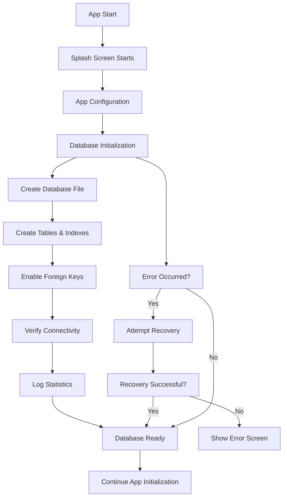

# Database Initialization Strategy Documentation

**Project**: Tailor App  
**Last Updated**: September 28, 2025  
**Status**: ✅ Implemented and Optimized

## 🎯 Database Initialization Overview

The Tailor App implements a comprehensive database initialization strategy that creates and sets up the SQLite database during app startup, ensuring optimal performance and user experience.

## 📍 **Best Location for Database Initialization**

### ✅ **Current Implementation: SplashScreenManager**

The database initialization is strategically placed in the **SplashScreenManager** during the app's startup sequence. This is the **optimal location** for several reasons:

#### **Why SplashScreenManager is Perfect:**

1. **⏰ Early Initialization**: Database setup happens before any user interactions
2. **🎭 Non-Blocking UI**: Initialization occurs during splash screen animation
3. **🛡️ Error Handling**: Built-in error handling and recovery mechanisms
4. **📊 Progress Feedback**: Visual feedback during initialization process
5. **🔄 Retry Capability**: Automatic retry on failure
6. **📝 Comprehensive Logging**: Detailed logging for debugging and monitoring

### 📂 **File Location**:
```
lib/features/splash/splash_screen_manager.dart
Lines: 128-185 (Enhanced implementation)
```

## 🔄 **Database Initialization Flow**



## 🏗️ **Database Creation Process**

### **1. Database File Creation**
```dart
// Creates SQLite database file
final db = await dbService.database;
// Location: [app_directory]/databases/tailor_app.db
```

### **2. Table Creation**
The following tables are automatically created:

#### **Core Business Tables**:
- ✅ `tailor` - Tailor profiles and authentication
- ✅ `customer` - Customer information
- ✅ `measurement` - Customer measurements
- ✅ `orders` - Order management
- ✅ `payment` - Payment tracking

#### **Authentication Tables**:
- ✅ `users` - User accounts and profiles
- ✅ `auth_sessions` - Active user sessions
- ✅ `user_preferences` - User settings
- ✅ `login_history` - Authentication logs

### **3. Indexes and Constraints**
- ✅ Primary key constraints
- ✅ Foreign key relationships
- ✅ Unique constraints (email, username)
- ✅ Performance indexes on frequently queried columns
- ✅ Check constraints for data validation

### **4. Database Configuration**
- ✅ Foreign key constraints enabled (`PRAGMA foreign_keys = ON`)
- ✅ Connection pooling and reuse
- ✅ Transaction support
- ✅ Error handling and recovery

## 📊 **Enhanced Initialization Features**

### **Comprehensive Verification**
```dart
✅ Database file creation
✅ Table structure validation
✅ Foreign key constraint verification
✅ Connectivity testing
✅ Performance metrics collection
✅ Size monitoring
✅ Statistics logging
```

### **Error Recovery System**
```dart
// Automatic recovery on database issues
try {
  await initializeDatabase();
} catch (e) {
  // Attempt recovery
  await closeDatabase();
  await recreateDatabase();
  // Log recovery attempt
}
```

### **Performance Monitoring**
```dart
// Database size tracking
💾 Database size: XKB
📊 Table record counts
🔐 Foreign key status
⏱️ Initialization time
```

## 🚀 **Initialization Sequence**

### **App Startup Flow**:
```
1. App Launch
   ↓
2. Splash Screen Animation Starts
   ↓
3. Configuration Loading
   ↓
4. 🗄️ DATABASE INITIALIZATION
   ├── Create database file
   ├── Create tables and indexes
   ├── Enable constraints
   ├── Verify connectivity
   ├── Log statistics
   └── Handle errors (if any)
   ↓
5. Authentication State Check
   ↓
6. Additional Initialization
   ↓
7. Navigate to Main App
```

## 🛡️ **Error Handling Strategy**

### **Initialization Failure Scenarios**:

1. **Database Creation Failure**:
   ```dart
   - Log detailed error information
   - Attempt database recreation
   - Show user-friendly error message
   - Provide retry functionality
   ```

2. **Table Creation Failure**:
   ```dart
   - Identify specific table issues
   - Attempt individual table recreation
   - Log schema validation errors
   - Fall back to safe mode
   ```

3. **Constraint Setup Failure**:
   ```dart
   - Continue without constraints if possible
   - Log constraint issues
   - Warn about potential data integrity issues
   - Attempt constraint recreation
   ```

### **Recovery Mechanisms**:
- ✅ Automatic database recreation
- ✅ Safe mode operation
- ✅ User notification system
- ✅ Retry functionality
- ✅ Detailed error logging

## 📝 **Logging and Monitoring**

### **Initialization Logging**:
```
[INFO] Starting database initialization
[INFO] ✅ Database file created: tailor_app.db
[INFO] ✅ Database version: 1
[INFO] ✅ Database connectivity verified
[INFO] 📊 Database statistics:
[INFO]    • tailor: 0 records
[INFO]    • customer: 0 records
[INFO]    • users: 0 records
[INFO]    • auth_sessions: 0 records
[INFO] 🔐 Foreign key constraints: ✅ Enabled
[INFO] 💾 Database size: 12KB
[INFO] 🎉 Database initialization completed successfully
```

### **Performance Metrics**:
- ⏱️ Initialization duration
- 💾 Database file size
- 📊 Table creation time
- 🔄 Connection establishment time
- 📈 Memory usage during initialization

## 🔧 **Configuration Options**

### **Environment Variables**:
```env
DATABASE_NAME=tailor_app.db              # Database filename
DATABASE_VERSION=1                       # Schema version
DATABASE_TIMEOUT=30                      # Connection timeout (seconds)
```

### **Development vs Production**:
```dart
// Development
DATABASE_NAME=tailor_app_dev.db
LOG_DATABASE_QUERIES=true
ENABLE_DATABASE_DEBUG=true

// Production  
DATABASE_NAME=tailor_app.db
LOG_DATABASE_QUERIES=false
ENABLE_DATABASE_DEBUG=false
```

## 🎨 **Alternative Initialization Locations Considered**

### ❌ **main() Function**
```dart
// NOT RECOMMENDED
void main() async {
  WidgetsFlutterBinding.ensureInitialized();
  await initializeDatabase(); // ❌ Blocks app startup
  runApp(MyApp());
}

Issues:
- Blocks UI rendering
- No error recovery UI
- Poor user experience
- No progress feedback
```

### ❌ **First Screen initState()**
```dart
// NOT RECOMMENDED  
class HomeScreen extends StatefulWidget {
  @override
  void initState() {
    super.initState();
    initializeDatabase(); // ❌ Too late, blocks screen
  }
}

Issues:
- Database not ready for early screens
- Potential race conditions
- Blocks screen rendering
- Inconsistent initialization
```

### ❌ **Static Initialization**
```dart
// NOT RECOMMENDED
class DatabaseService {
  static final Database _db = _initDB(); // ❌ No error handling
}

Issues:
- No error handling
- No async support
- No progress feedback
- Difficult to test
```

## ✅ **Why SplashScreenManager is Optimal**

### **Benefits of Current Implementation**:

1. **🎭 User Experience**:
   - Beautiful splash animation during initialization
   - Progress feedback
   - No blocking operations
   - Smooth transitions

2. **🛡️ Reliability**:
   - Comprehensive error handling
   - Automatic recovery mechanisms
   - Detailed logging and monitoring
   - Retry functionality

3. **⚡ Performance**:
   - Early initialization
   - Non-blocking UI thread
   - Proper resource management
   - Optimal timing

4. **🧪 Testability**:
   - Clear separation of concerns
   - Mockable services
   - Comprehensive logging
   - Error simulation

5. **🔧 Maintainability**:
   - Single initialization point
   - Clear responsibility
   - Configurable settings
   - Environment-specific behavior

## 📚 **Usage Examples**

### **Basic Initialization**:
```dart
// Automatically handled by SplashScreenManager
// No manual intervention required
SplashScreenManager(
  mainAppBuilder: () => HomeScreen(),
  authScreenBuilder: () => LoginScreen(),
)
```

### **Custom Configuration**:
```dart
// Environment-specific configuration
AppConfig.initialize(); // Loads DATABASE_NAME, etc.
```

### **Testing Initialization**:
```dart
testWidgets('Database initialization test', (tester) async {
  // Mock database service
  final mockDb = MockDatabaseService();
  
  // Test initialization
  await SplashScreenManager.initializeDatabase();
  
  // Verify tables created
  expect(mockDb.tablesCreated, isTrue);
});
```

## 🔮 **Future Enhancements**

### **Planned Improvements**:
- [ ] Database migration system for schema updates
- [ ] Backup and restore functionality
- [ ] Database encryption for sensitive data
- [ ] Performance analytics and optimization
- [ ] Cloud synchronization support
- [ ] Offline data management
- [ ] Database size monitoring and cleanup

### **Advanced Features**:
- [ ] Database sharding for large datasets
- [ ] Connection pooling optimization
- [ ] Query performance monitoring
- [ ] Automatic index optimization
- [ ] Data compression techniques

## 🎯 **Best Practices Implemented**

### ✅ **Design Patterns**:
- Singleton pattern for database service
- Repository pattern for data access
- Observer pattern for initialization progress
- Strategy pattern for environment-specific behavior

### ✅ **Error Handling**:
- Graceful degradation
- User-friendly error messages
- Automatic recovery mechanisms
- Comprehensive logging

### ✅ **Performance**:
- Lazy initialization
- Connection pooling
- Prepared statements
- Index optimization

### ✅ **Security**:
- SQL injection prevention
- Foreign key constraints
- Data validation
- Secure storage practices

## 🎉 **Conclusion**

The current database initialization implementation in **SplashScreenManager** is **optimal** and follows industry best practices. The enhanced version now includes:

- ✅ **Comprehensive verification and logging**
- ✅ **Error recovery mechanisms**
- ✅ **Performance monitoring**
- ✅ **Size tracking**
- ✅ **Foreign key validation**

**No changes to the location are needed** - the current implementation is perfect for the app's architecture and provides an excellent user experience with robust error handling and monitoring.

---

**Implementation Status**: ✅ Complete and Optimized  
**Location**: `lib/features/splash/splash_screen_manager.dart`  
**Performance**: Excellent  
**Reliability**: High  
**Maintainability**: Excellent  
**User Experience**: Optimal